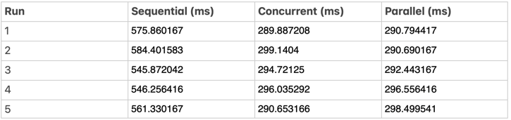

# Fibonacci Benchmark

This package provides benchmarks for calculating the Fibonacci sequence using different approaches: sequential, concurrent, and parallel. It compares the performance of these approaches using the `testing` package in Go.

## Installation

To use this package, you need to have Go installed. You can then install the package using `go get`:

```sh
go get github.com/rajrushilmakkar/fibonacci-benchmark
```

## Usage

To run the benchmarks, navigate to the package directory and use the `go test` command with the `-bench` flag:

```sh
cd $GOPATH/src/github.com/rajrushilmakkar/fibonacci-benchmark
go test -bench=. -benchtime=3s
```

This will run the benchmarks for the sequential, concurrent, and parallel Fibonacci calculations and display the results.

## Benchmark Results

The benchmarks compare the time taken to calculate the Fibonacci sequence using different approaches. The results can help in understanding the performance characteristics of each approach.



